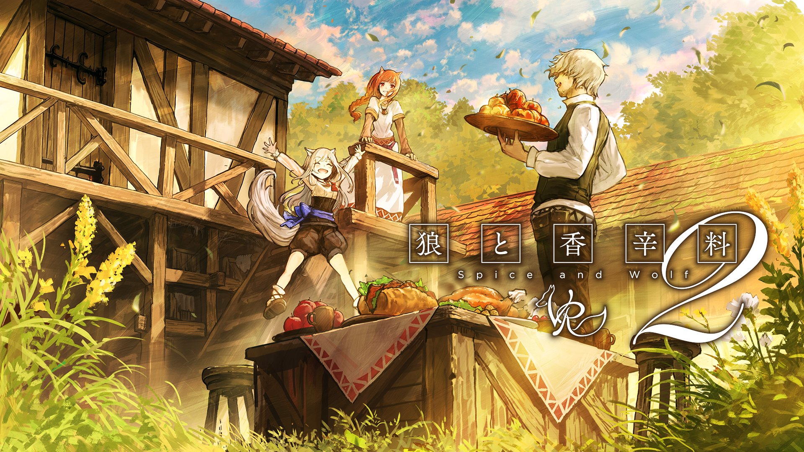

```{r setup, include=FALSE}
knitr::opts_chunk$set(echo = TRUE)
```

<br>
<br>
<br>

# **Introducción**
***
Spice and Wolf (狼と香辛料, Ōkami to Kōshinryō) es una serie de novelas ligeras japonesas escritas por Isuna Hasekura. La publicación de las novelas comenzaron el 2006 y hasta el día de hoy lleva 23 novelas escritas, siendo una de las novelas más leídas en Japón. 

Aprovechando el trabajo que realicé ayudando en la traducción de la novela al español, mi fanatismo por la serie y la necesidad de realizar un análisis para el ramo de PNL del magister en Data Science de la Universidad del Desarrollo realizaré el análisis de sentimientos del mundo de las novelas de Spice and Wolf para analizar como escribe el autor.

Para este informe se siguió el trabajo de [Xavier](https://www.kaggle.com/xvivancos) en sus análisis de [Star Wars](https://www.kaggle.com/xvivancos/analyzing-star-wars-movie-scripts) y [Lord of the Rings](https://www.kaggle.com/xvivancos/analyzing-the-lord-of-the-rings-data).




# **Carga de librerías y archivos**
***
Para la obtención del texto de las novelas se realizó la transcripción de las 23 novelas ligeras a archivos de texto. Junto a estos archivos de texto se realizó la carga de los léxicos (o lexicon en inglés) para realizar el análisis de sentimientos. Además, para este trabajo se necesitó herramientas de text mining, manipulación de dataframes, entre otros, especificados a continuación:

```{r message=FALSE, warning=FALSE}

#Se cargan las librerías
library(tidyverse) #Manipulación de datos
library(tm) #Text mining
library(wordcloud) #Generador de nube de palabras
library(wordcloud2) #Generador de nube de palabras
library(tidytext) #Text mining y procesado de palabras
library(reshape2) #Modificación a dataframes
library(RWeka) #Data Mining y tokenizador
library(knitr) #Generación de markdowns
library(readtext) #Para la lectura de los txt
library(kableExtra)


#Se cargan los archivos
FILEDIR = "data_holo/PDF/"
filenames <- list.files(FILEDIR)
filenames <- gsub(".txt$", "", filenames)
txts <- readtext(FILEDIR)

#Se cargan los léxicos para el análisis de sentimiento
bing <- read_csv("data/lexi/Bing.csv")
nrc <- read_csv("data/lexi/NRC.csv")
afinn <- read_csv("data/lexi/Afinn.csv")

```


# **Preprocesado de las novelas**
***
Antes de realizar cualquier análisis es necesario ordenar las columnas según su orden de publicación. Además se debe limpiar el texto para poder utilizarlo. La limpieza consistirá en eliminar carácteres extraños, tabulaciones, espacios, saltos de línea, números, juntar palabras, eliminar stopwords y puntuaciones.

```{r message=FALSE, warning=FALSE}

#Se crea el orden de las novelas para crear transformar las variables a factor ordenado
order_levels <- c("Spice and Wolf  Vol1","Spice and Wolf  Vol2","Spice and Wolf  Vol3",
                  "Spice and Wolf  Vol4","Spice and Wolf  Vol5","Spice and Wolf  Vol6",
                  "Spice and Wolf  Vol7","Spice and Wolf  Vol8","Spice and Wolf  Vol9",
                  "Spice and Wolf  Vol10","Spice and Wolf  Vol11","Spice and Wolf  Vol12",
                  "Spice and Wolf  Vol13","Spice and Wolf  Vol14","Spice and Wolf  Vol15",
                  "Spice and Wolf  Vol16","Spice and Wolf  Vol17","Spice and Wolf  Vol18",
                  "Spice and Wolf  Vol19","Spice and Wolf  Vol20","Spice and Wolf  Vol21",
                  "Spice and Wolf s2 Vol1","Spice and Wolf s2 Vol2"
                  )
#Se cambia el tipo de columna con los nombres a factor
txts$doc_id <- factor(txts$doc_id, levels = order_levels)


#Se crea una función para eliminar el caracter 's expresado en el código de lectura como ’s
tryfunc <- function(x) gsub("’s", "", x)
#Limpieza del texto, se remueven todos los carácteres que no se quieren 
#utilizar y se corrige separaciones erroneas con la función CleanCorpus

cleanCorpus <- function(corpus){
  #Para realizar la limpieza la entrada tiene que estar en formato corpus
  s.cor <- Corpus(VectorSource(corpus))
  corpus.tmp <- tm_map(s.cor, function(x) gsub("\\t", " ", x)) #Eliminar tabulaciones
  corpus.tmp <- tm_map(corpus.tmp, function(x) gsub("\\n", " ", x)) #Eliminar saltos de línea
  corpus.tmp <- tm_map(corpus.tmp, function(x) gsub("—", " ", x)) #Eliminar doble -- unido
  corpus.tmp <- tm_map(corpus.tmp, function(x) gsub("-", "", x)) #Eliminar  -

  corpus.tmp <- tm_map(corpus.tmp, removePunctuation) #Remover puntuaciones
  corpus.tmp <- tm_map(corpus.tmp, stripWhitespace) #Remover espacios
  corpus.tmp <- tm_map(corpus.tmp, content_transformer(tolower)) #Dejar en minúscula
  v_stopwords <- c(stopwords("english"), c("thats","weve","hes","theres","ive","im",
                                           "will","can","cant","dont","youve","us",
                                           "youre","youll","theyre","whats","didnt",
                                           "chapter","p","g","e","like")) 
  corpus.tmp <- tm_map(corpus.tmp, removeNumbers) #Eliminar números
  corpus.tmp <- tm_map(corpus.tmp, PlainTextDocument) #Dejar texto plano
  #Eliminar stopwords y otras palabras
  corpus.tmp <- tm_map(corpus.tmp, removeWords, v_stopwords) 
  #Remplaza el nombre le'roi a leroi
  corpus.tmp <- tm_map(corpus.tmp, function(x) gsub("le roi", "leroi", x)) 
  #Separación erronea "com pany"
  corpus.tmp <- tm_map(corpus.tmp, function(x) gsub("com pany", "company", x))
  #Separación erronea "kie man"
  corpus.tmp <- tm_map(corpus.tmp, function(x) gsub("kie man", "kieman", x))
  #Separación erronea "kie man"
  corpus.tmp <- tm_map(corpus.tmp, function(x) gsub("mil ton", "milton", x)) 
  #Separación erronea "mer cenary"
  corpus.tmp <- tm_map(corpus.tmp, function(x) gsub("mer cenary", "mercenary", x)) 
  return(corpus.tmp[[1]][1])} #Retorna el array dentro del corpus creado

#Se crean dos bucles. El primero elimina el caracter 's
for(i in 1:length(txts$doc_id)){
  txts[i,2] <- tryfunc(txts[i,2])
}

#Luego se intercambia la codificación para que aparezcan las tabulaciones y saltos
#como \t y \n
txts$text<- iconv(txts$text, 'utf-8', 'ascii', sub='')

#El segundo bucle aplica la función cleanCorpus
for(i in 1:length(txts$doc_id)){
  txts[i,2] <- cleanCorpus(txts[i,2])
}

#Se ordena el dataframe según el factor creado
txts <- txts %>% arrange(doc_id)
```

# **Analisis de los datos**
***
El analisis se separa en la creación de wordclouds, separación entre palabras según el sentimiento y análisis de monogramas, bigramas y trigramas.

## **Nube de palabras según su frecuencia**
***
Una forma visual de comenzar el análisis es realizar una nube de palabras donde el tamaño de las palabras depende de la frecuencia de aparición en el texto. Por problemas con la librería se realizó una captura del wordcloud y se publicó como imagen.

```{r message=FALSE, warning=FALSE,fig.dim = c(7,7)}

#Se crea otra función CleanCorpus2 para poder ser utilizada en la siguiente función
cleanCorpus2 <- function(corpus){
  corpus.tmp <- tm_map(corpus, removePunctuation)
  corpus.tmp <- tm_map(corpus.tmp, stripWhitespace)
  corpus.tmp <- tm_map(corpus.tmp, content_transformer(tolower))
  v_stopwords <- c(stopwords("english"), c("thats","weve","hes","theres","ive","im",
                                           "will","can","cant","dont","youve","us",
                                           "youre","youll","theyre","whats","didnt", "like"))
  corpus.tmp <- tm_map(corpus.tmp, removeWords, v_stopwords)
  return(corpus.tmp)
  
}

# Se crea una función para realizar el conteo de palabras
frequentTerms <- function(text){
  #La funcion Corpus del paquete tm crea  y computa el corpus
  #Mientras que la función VectorSource interpreta cada elemento de 
  #text como un documento
  s.cor <- Corpus(VectorSource(text))
  #Se aplica la primera función creada cleanCorpus2
  s.cor.cl <- cleanCorpus2(s.cor)
  #Del paquete tm transforma el documento a una matriz
  s.tdm <- TermDocumentMatrix(s.cor.cl)
  #Remueve elementos que aparecen en pequeñas cantidades
  s.tdm <- removeSparseTerms(s.tdm, 0.999)
  #Transforma los datos a una matriz de R
  m <- as.matrix(s.tdm)
  #Se suma por fila para obtener la frecuencia
  #Como está ordenado como matriz se ordena según la frecuencia más alta
  word_freqs <- sort(rowSums(m), decreasing=TRUE)
  #Se crea un dataframe con estas frecuencias
  dm <- data.frame(word=names(word_freqs), freq=word_freqs)
  return(dm)
  
}

#wordcloud2 tiene problemas al crear las nubes cuando palabras destacan mucho por 
#sobre otras, por lo cual se le asignó un valor más adecuado.
jj <- frequentTerms(txts$text)
jj[1,2] = 7000
jj[2,2] = 6000

hw = wordcloud2(jj, size=3, figPath ="../Imagen4.png")

```

Se puede observar que las palabras que más aparecen es Holo y Lawrence, protagonistas de la serie.


<center>

<br>
<br>
<br>


{width=370px}

</center>

## **Nube de palabras según léxico Bing**
***

A continuación se realizó el wordcloud de las palabras separadas según el léxico genérico de bing, de [Bing Liu y colaboradores](https://www.cs.uic.edu/~liub/FBS/sentiment-analysis.html) que separó palabras según negativas y positivas. El léxico bing se ve de la siguiente manera:
`


```{r echo = FALSE, result = 'asis'}

i = 4299
j = i+5
bing[i:j,] %>%
  kbl() %>%
  kable_paper("hover", full_width = F)

```
Se observa que el léxico bing separa las palabras en positivas y negativas.

```{r message=FALSE, warning=FALSE,fig.dim = c(7,7),fig.align='center'}
#Tokeniza el texto de las novelas
tokens <- txts %>%  
  mutate(text=as.character(txts$text)) %>%
  unnest_tokens(word, text)

tokens %>%
  inner_join(get_sentiments("bing")) %>% #Se agrega si son palabras positivas o negativas
  count(word, sentiment, sort=TRUE) %>% #Se realiza el conteo de las palabras
  acast(word ~ sentiment, value.var="n", fill=0) %>% #Separa en positivo o negativo
  comparison.cloud(colors=c("#3399FF", "#CC6600"), max.words=300, title.size = 2, 
                   title.colors = c("#3399FF", "#CC6600")) #Se crea la nube de palabras
```


## **Análisis de sentimiento utilizando el léxico NRC**
***

El siguiente análisis utiliza el lexicon NRC, de [Saif Mohammad y Peter Turney](http://saifmohammad.com/WebPages/NRC-Emotion-Lexicon.htm), el cual no solo contiene la denominación de las palabras como positivo y negativo, contiene sentimientos (o emociones) de verdad, anticipación, sorpresa, enojo, entre otros. Este análisis se realizará considerando todas las novelas en su conjunto. El léxico NRC se ve de la siguiente manera:

```{r echo = FALSE, result = 'asis'}

i = 7685
j = i+5
nrc[i:j,] %>%
  kbl() %>%
  kable_paper("hover", full_width = F)

```

Se observa que el léxico NRC contiene palabras separadas como positivas, negativas, pero además otras como miedo, tristeza, entre otras emociones. Con el léxico se realizó el conteo de palabras correspondientes a los sentimientos y emociones del universo de las novelas.


```{r message=FALSE, warning=FALSE,fig.dim = c(11, 7), out.width = "150%", out.height = "150%"}


#Se crea una paleta de colores para el gráfico
palette1 = c("#f4d9b8", "#daa688", "#f3e5d4", "#f3cd9c", 
             "#e3beaa", "#c17646", "#b35e25", "#f4d3aa", "#f4dfc6", "#ce8e66" )

# Sentimientos y frecuencia asociada a cada palabra 
sentiments <- tokens %>% 
  inner_join(nrc, "word") %>%
  count(word, sentiment, sort=TRUE) 


# Grárico de frecuencia de cada sentimiento
ggplot(data=sentiments, aes(x=reorder(sentiment, -n, sum), y=n)) + 
  geom_bar(stat="identity", aes(fill=sentiment), show.legend=FALSE) +
  scale_fill_manual(values=palette1) +
  labs(x="Sentimiento", y="Frecuencia") +
  ggtitle("Frecuencia según el sentimiento de léxico NRC") +
  theme_bw() +
  theme(plot.title = element_text(hjust = 0.5))

```

Se puede observar que el sentimiento que predomina es el positivo sobre el negativo. Además de sentimientos como verdad y anticipación, debido a que es una novela de una pareja de comerciantes, es más que esperable que aparezcan.


### **Palabras más frecuentes según el sentimiento usando léxico NRC**


Se realizó el análisis de palabras más frecuentes según el sentimiento, considerando todas las novelas en su conjunto
```{r message=FALSE, warning=FALSE,fig.dim = c(10, 8), out.width = "150%", out.height = "150%"}
palette = c("#fcc082","#d68128","#d68128","#d68128","#d68128","#e1a35f",
            "#e1a35f","#e1a35f","#e1a35f","#fcc082","#fcc082","#fcc082")
sentiments %>%
  group_by(sentiment) %>%
  arrange(desc(n)) %>%
  slice(1:10) %>%
  ggplot(aes(x=reorder(word, n), y=n)) +
  geom_col(aes(fill=sentiment), show.legend=FALSE)  +
  scale_fill_manual(values=palette) +
  facet_wrap(~sentiment, scales="free_y") +
  labs(y="Frecuencia", x="Término") +
  coord_flip() +
  ggtitle("Términos más repetidos por sentimiento usando léxico NRC") +
  theme_bw() +
  theme(plot.title = element_text(hjust = 0.5))
```
Se puede observar que palabras como money, **ill**, **church**, **lie**, **god** son palabras muy esperadas para una novela ambientada en el tiempo medieval. En cuanto a los sentimientos que le corresponde a  cada palabra son esperables, **ill** (enfermo), representa enojo, disgusto, miedo, tristeza; **money** (moneda) representa anticipación, enojo, alegría, positivo, sorpresa, confianza. Con esto nos damos cuenta que es muy dificil para el código contextualizar las palabras, aunque nos ayuda a tener una idea general del problema.


### **Sentimientos más frecuentes según la novela usando léxico NRC**


Otro análisis que se realizó es el de sentimientos pero por novela utilizando el léxico NRC. Por temas estéticos los gráficos se separarán desde la novela 1 a la 12 y de la 13 a la 23


#### **Sentimientos Novelas 1-12**

```{r message=FALSE, warning=FALSE,fig.dim = c(10, 8), out.width = "150%", out.height = "150%"}
tokens %>%
  filter(doc_id %in% order_levels[1:12]) %>%
  inner_join(nrc, "word") %>%
  count(doc_id, sentiment, sort=TRUE) %>%
  ggplot(aes(x=sentiment, y=n)) +
  geom_col(aes(fill=doc_id), show.legend=FALSE) +
  scale_fill_manual(values=palette) +
  facet_wrap(~doc_id, scales="free_y") +
  labs(x="Sentimiento", y="Frecuencia") +
  coord_flip() +
  ggtitle("Frecuencia de sentimientos por volumen") +
  theme_bw() +
  theme(plot.title = element_text(hjust = 0.5))
```


#### **Sentimientos Novelas 13-23**

```{r message=FALSE, warning=FALSE,fig.dim = c(10, 8), out.width = "150%", out.height = "150%"}
tokens %>%
  filter(doc_id %in% order_levels[13:23]) %>%
  inner_join(nrc, "word") %>%
  count(doc_id, sentiment, sort=TRUE) %>%
  ggplot(aes(y=sentiment, x=n)) +
  geom_col(aes(fill=doc_id), show.legend=FALSE) +
  facet_wrap(~doc_id, scales="free_y") +
  scale_fill_manual(values=palette) +
  labs(x="Sentimiento", y="Frecuencia") +
  ggtitle("Frecuencia de sentimientos por volumen") +
  theme_bw() +
  theme(plot.title = element_text(hjust = 0.5))
```

Se puede observar comportamientos muy parecidos entre  las novelas. Exceptuando por el volumen 16 donde el sentimiento negativo sobrepasa el positivo, lo cual si se sigue la lectura de este volumen es esperable al encontrarse en un ambiente de guerras entre ciudades.

## **Análisis de sentimiento utilizando el léxico AFINN**
***

Otro léxico que se puede utilizar es el [AFINN](http://www2.imm.dtu.dk/pubdb/pubs/6010-full.html), el que da puntaje según el tipo de palabra. A valores negativos, sentimientos negativos y vice versa. El siguiente gráfico muestra cuantas palabras corresponden a cada puntaje. El léxico AFINN se ve de la siguiente manera:

```{r echo = FALSE, result = 'asis'}

i = 235
j = i+5
afinn[i:j,] %>%
  kbl() %>%
  kable_paper("hover", full_width = F)

```

Se observa que el léxico AFINN entrega valoraciones a las palabras de que tan positivas y que tan negativas son.

```{r message=FALSE, warning=FALSE,fig.dim = c(10, 8), out.width = "150%", out.height = "150%"}

tokens %>% 
  inner_join(afinn, "word") %>% 
  count(value, sort=T) %>%
  ggplot(aes(x=value, y=n)) +
  geom_bar(stat="identity", aes(fill=n), show.legend=FALSE, width=0.5) +
  geom_label(aes(label=n)) +
  scale_fill_gradient(low="#f3cd9c", high="#b35e25") +
  scale_x_continuous(breaks=seq(-5, 5, 1)) +
  labs(x="Puntaje", y="Frecuencia") +
  ggtitle("Distribución de palabras según el léxico AFINN") +
  theme_bw() +
  theme(plot.title = element_text(hjust = 0.5)) 


```

Del gráfico se observa una cantidad parecida de palabras negativas y positivas en el puntaje -2 y 2 respectivamente. Mientras que en los puntajes 1 y 3 predominan los sentimientos positivos.

Teniendo la información con su puntaje se realizó el gráfico donde se calcula el aporte de cada palabra multiplicando sus apariciones por el puntaje asignado.
```{r message=FALSE, warning=FALSE,fig.dim = c(10, 8), out.width = "150%", out.height = "150%"}

tokens %>% 
  inner_join(afinn, "word") %>% 
  count(word, value, sort=T) %>% 
  mutate(contribution=n*value) %>%
  arrange(desc(abs(contribution))) %>%
  head(26) %>%
  ggplot(aes(x=reorder(word, contribution), y=contribution, fill=n*value>0)) +
  geom_col(show.legend=FALSE) +
  geom_label(aes(label=value),y=0, fill = "white") +
  geom_label(aes(label=value*n), fill = "white") +
  scale_fill_manual(values=c("#b35e25", "#f3cd9c")) + 
  labs(x="Términos", y="Puntaje del sentimiento x Numero de ocurrencias") +
  coord_flip() +
  theme_bw() +
  ggtitle("Top 26 de puntaje por término utilizando el léxico AFINN") +
  theme_bw() +
  theme(plot.title = element_text(hjust = 0.5)) +
  theme(legend.position="none")


```

Del gráfico se observan una mayor cantidad de palabras positivas entre las 26 con mayor puntaje. De las palabras **good** (bueno), **smile** (sonrisa) y **great** (estupendo/grande) son las que más aportan a sentimientos positivos; mientras que **ill** (enfermo), **bad** (malo), **angry** (enojado) son las que más aportan al sentimiento negativo.


## **Análisis de monogramas según el Volumen**
***

Finalmente se realizó el análisis de las palabras más repetidas por volumen.  Para realizar este análisis se tomarán dos enfoques: el de frecuencia absoluta y de frecuencia inversa.

### **Enfoque de frecuencia absoluta**


El primer enfoque realizado fue utilizando la frecuencia en la aparición de palabras.

#### **Frecuencia en Novelas 1-12**

```{r message=FALSE, warning=FALSE,fig.dim = c(10, 8), out.width = "150%", out.height = "150%"}
mystopwords <- data_frame(word=c(stopwords("english"), 
                                 c("thats","weve","hes","theres","ive","im",
                                   "will","can","cant","dont","youve","us",
                                   "youre","youll","theyre","whats","didnt")))

#Se tokeniza el texto de cada novela
top.chars.tokens <- txts %>%
  slice_head(n = 12) %>%
  mutate(text=as.character(txts[1:12,1:2]$text)) %>%
  unnest_tokens(word, text) %>%
  anti_join(mystopwords, by="word")

#Se realiza el conteo de cada palabra en cada novela y se grafica
top.chars.tokens %>%
  count(doc_id, word) %>%
  group_by(doc_id) %>% 
  arrange(desc(n)) %>%
  slice(1:10) %>%
  ungroup() %>%
  mutate(word2=factor(paste(word, doc_id, sep="__"), 
                      levels=rev(paste(word, doc_id, sep="__"))))%>%
  ggplot(aes(x=word2, y=n)) +
  geom_col(aes(fill=doc_id), show.legend=FALSE) +
  facet_wrap(~doc_id, scales="free_y") +
  scale_fill_manual(values=palette) +
  theme(axis.text.x=element_text(angle=45, hjust=1)) +
  labs(y="Frecuencia", x="Término") +
  scale_x_discrete(labels=function(x) gsub("__.+$", "", x)) +
  coord_flip() +
  ggtitle("Frecuencia de los términos según el volumen") +
  theme_bw() +
  theme(plot.title = element_text(hjust = 0.5))
```


#### **Frecuencias en Novelas 13-23**

```{r message=FALSE, warning=FALSE,fig.dim = c(10, 8), out.width = "150%", out.height = "150%"}

mystopwords <- data_frame(word=c(stopwords("english"), 
                                 c("thats","weve","hes","theres","ive","im",
                                   "will","can","cant","dont","youve","us",
                                   "youre","youll","theyre","whats","didnt",
                                   "klass","aryes")))


top.chars.tokens <- txts %>%
  slice_tail(n = 11) %>%
  mutate(text=as.character(txts[13:23,1:2]$text)) %>%
  unnest_tokens(word, text) %>%
  anti_join(mystopwords, by="word")


top.chars.tokens %>%
  count(doc_id, word) %>%
  group_by(doc_id) %>% 
  arrange(desc(n)) %>%
  slice(1:10) %>%
  ungroup() %>%
  mutate(word2=factor(paste(word, doc_id, sep="__"), 
                      levels=rev(paste(word, doc_id, sep="__"))))%>%
  ggplot(aes(x=word2, y=n)) +
  geom_col(aes(fill=doc_id), show.legend=FALSE) +
  facet_wrap(~doc_id, scales="free_y") +
  scale_fill_manual(values=palette) +
  theme(axis.text.x=element_text(angle=45, hjust=1)) +
  labs(y="Frecuencia", x="Término", 
       title = "Frecuencia de los sentimientos según el volumen") +
  scale_x_discrete(labels=function(x) gsub("__.+$", "", x)) +
  coord_flip() +
  ggtitle("Frecuencia de los términos según el volumen") +
  theme_bw() +
  theme(plot.title = element_text(hjust = 0.5))
```
Es de esperar que las palabras más repetidas sean **Lawrence** y **Holo** al ser los protagonistas de la serie o personajes muy importantes como Fleur en la novela 3 o Myuri y Col en las dos últimas novelas donde toman el protagonismo de las novelas. El problema es que estas eclipsan la aparición de otras palabras al dar importancia solo por su frecuencia, es por esto que se tomará otro enfoque.

### **Enfoque de frecuencia inversa de documento**


Para obtener la relevancia de cada palabra se utilizó la función bind_tf_idf (term frequency -inverse document frecuency). Esta  función encuentra las palabras más importantes del documento disminuyendo el peso de las palabras más frecuentes e incrementando el peso de aquellas que no.

#### **Frecuencia inversa Novelas 1-12**

```{r message=FALSE, warning=FALSE,fig.dim = c(10, 8), out.width = "150%", out.height = "150%"}


mystopwords <- data_frame(word=c(stopwords("english"), 
                                 c("thats","weve","hes","theres","ive","im",
                                   "will","can","cant","dont","youve","us",
                                   "youre","youll","theyre","whats","didnt")))

top.chars.tokens <- txts %>%
  slice_head(n = 12) %>%
  mutate(text=as.character(txts[1:12,1:2]$text)) %>%
  unnest_tokens(word, text) %>%
  anti_join(mystopwords, by="word")


top.chars.tokens %>%
  count(doc_id, word) %>%
  bind_tf_idf(word, doc_id, n) %>%
  group_by(doc_id) %>% 
  arrange(desc(tf_idf)) %>%
  slice(1:10) %>%
  ungroup() %>%
  mutate(word2=factor(paste(word, doc_id, sep="__"), 
                      levels=rev(paste(word, doc_id, sep="__"))))%>%
  ggplot(aes(x=word2, y=tf_idf)) +
  geom_col(aes(fill=doc_id), show.legend=FALSE) +
  facet_wrap(~doc_id, scales="free_y") +
  scale_fill_manual(values=palette) +
  theme(axis.text.x=element_text(angle=45, hjust=1)) +
  labs(y=" Frecuencia inversa de documento", x="Término") +
  scale_x_discrete(labels=function(x) gsub("__.+$", "", x)) +
  coord_flip() +
  ggtitle("Frecuencia inversa de documento de términos según el volumen") +
  theme_bw() +
  theme(plot.title = element_text(hjust = 0.5))
```


#### **Frecuencia inversa Novelas 13-23**

```{r message=FALSE, warning=FALSE,fig.dim = c(10, 8), out.width = "150%", out.height = "150%"}

mystopwords <- data_frame(word=c(stopwords("english"), 
                                 c("thats","weve","hes","theres","ive","im",
                                   "will","can","cant","dont","youve","us",
                                   "youre","youll","theyre","whats","didnt",
                                   "klass","aryes")))


top.chars.tokens <- txts %>%
  slice_tail(n = 11) %>%
  mutate(text=as.character(txts[13:23,1:2]$text)) %>%
  unnest_tokens(word, text) %>%
  anti_join(mystopwords, by="word")


top.chars.tokens %>%
  count(doc_id, word) %>%
  bind_tf_idf(word, doc_id, n) %>%
  group_by(doc_id) %>% 
  arrange(desc(tf_idf)) %>%
  slice(1:10) %>%
  ungroup() %>%
  mutate(word2=factor(paste(word, doc_id, sep="__"), 
                      levels=rev(paste(word, doc_id, sep="__"))))%>%
  ggplot(aes(x=word2, y=tf_idf)) +
  geom_col(aes(fill=doc_id), show.legend=FALSE) +
  facet_wrap(~doc_id, scales="free_y") +
  scale_fill_manual(values=palette) +
  theme(axis.text.x=element_text(angle=45, hjust=1)) +
  labs(y=" Frecuencia inversa de documento", x="Término", 
       title = "Frecuencia inversa de documento de los sentimientos según el volumen") +
  scale_x_discrete(labels=function(x) gsub("__.+$", "", x)) +
  coord_flip() +
  ggtitle("Frecuencia inversa de documento de términos según el volumen") +
  theme_bw() +
  theme(plot.title = element_text(hjust = 0.5))

```

Al darle peso a otras palabras nos encontramos con los personajes secundarios que generan la trama de cada volumen, **Fleur** y **Milton** en el Vol11, **Fran** en el Vol12, **Hilde** en el volumen 16, **Luward** en el volumen 15 entre otros. Además se puede obtener una idea de las novelas según algunas palabras que aparecieron, como **shepherd** (pastor) en el Vol2, **pyrite** (pirita) en el Vol3, **boat** (bote) en el Vol6, entre otros, que son parte de las temáticas más importantes de cada volumen respectivamente.

## **Análisis de bigramas y trigramas**
***

El análisis de bigramas y trigramas constará de dos secciones: la primera se realizará considerando todas las novelas y el segundo se realizará el estudio novela a novela.

### **Análisis considerando todas las novelas**


Para realizar el análisis de bigramas, se deben crear funciones que logren tokenizar en bigramas y trigramas. Para ello nos ayudaremos de la librería RWeka
```{r}
#Define el tokenizador de bigramas
tokenizer2  <- function(x){

  NGramTokenizer(x, Weka_control(min=2, max=2))

}

#Define el tokenizador de trigramas
tokenizer3  <- function(x){

  NGramTokenizer(x, Weka_control(min=3, max=3))

}

#Se aplica el tokenizador y se obtiene una lista con los bigramas
frequentBigrams <- function(text){

  s.cor <- VCorpus(VectorSource(text))
  s.tdm <- TermDocumentMatrix(s.cor, control=list(tokenize=tokenizer2))
  s.tdm <- removeSparseTerms(s.tdm, 0.999)
  m <- as.matrix(s.tdm)
  word_freqs <- sort(rowSums(m), decreasing=TRUE)
  dm <- data.frame(word=names(word_freqs), freq=word_freqs)
  return(dm)

}

#Se aplica el tokenizador y se obtiene una lista con los trigramas
frequentTrigrams <- function(text){

  s.cor <- VCorpus(VectorSource(text))
  s.tdm <- TermDocumentMatrix(s.cor, control=list(tokenize=tokenizer3))
  s.tdm <- removeSparseTerms(s.tdm, 0.999)
  m <- as.matrix(s.tdm)
  word_freqs <- sort(rowSums(m), decreasing=TRUE)
  dm <- data.frame(word=names(word_freqs), freq=word_freqs)
  return(dm)

}
```


Con las funciones creadas se obtienen los bigramas y trigramas utilizando nuestro dataframe de las novelas y preprocesado. Con la información obtenida se realizan los gráficos de los bigramas y trigramas que más aparecen en la totalidad de las novelas.

```{r message=FALSE, warning=FALSE,fig.dim = c(7,7)}

# Bigramas considerando todas las novelas
bigrams <- frequentBigrams(iconv(txts$text, from="UTF-8", to="ASCII//TRANSLIT"))
bigrams1 <- bigrams[1:15,]

plot1 <- ggplot(data=bigrams1, aes(x=reorder(word, freq), y=freq)) +  
  geom_bar(stat="identity", aes(fill=freq), show.legend=FALSE) +
  geom_label(label=bigrams1$freq) +
  scale_fill_gradient(low="darkorange", high="darkorange4") +
  labs(x="Bigrama", y="Frecuencia") +
  coord_flip() +
  theme_bw() +
  ggtitle("Frecuencia de bigramas") +
  theme_bw() +
  theme(plot.title = element_text(hjust = 0.5))

plot1

```

```{r message=FALSE, warning=FALSE,fig.dim = c(7,7)}
# Trigramas considerando todas las novelas
trigrams <- frequentTrigrams(iconv(txts$text, from="UTF-8", to="ASCII//TRANSLIT"))
trigrams1 <- trigrams[1:15,]

plot2 <- ggplot(data=trigrams1, aes(x=reorder(word, freq), y=freq)) +  
  geom_bar(stat="identity", aes(fill=freq), show.legend=FALSE) +
  geom_label(label=trigrams1$freq) +
  scale_fill_gradient(low="goldenrod1", high="goldenrod4") +
  labs(x="Trigrama", y="Frecuencia") +
  coord_flip() +
  theme_bw() +
  ggtitle("Frecuencia de trigramas") +
  theme_bw() +
  theme(plot.title = element_text(hjust = 0.5))

plot2
```


Al analizar los bigramas nos encontramos con acciones que generalmente los personajes Lawrence y Holo realizan: **said Lawrence** (Dijo Lawrence), **said Holo** (dijo Holo), **Holo looked** (Holo miró), entre otros.

Al analizar los trigramas nos damos cuentas que en general aparecen las intituciones: **Rowen Trade Guild**, **Myuri Mercenary Company**, **Hugo Mercenary Company**, entre otros.

### **Análisis de cada volumen**

Ahora se realizará un análisis de bigramas y trigramas por novela. Para ello necesitamos que estos se etiqueten según la novela.

```{r}
bigrams_pernovel <- frequentBigrams(iconv(txts$text[1], 
                                          from="UTF-8", to="ASCII//TRANSLIT"))
bigrams_pernovel$doc_id <- txts[1,1]


for (i in 2:23){
  bigrams_forappend <- frequentBigrams(iconv(txts$text[i], 
                                             from="UTF-8", to="ASCII//TRANSLIT"))
  bigrams_forappend$doc_id <- txts[i,1]
  bigrams_pernovel <- rbind(bigrams_pernovel,bigrams_forappend)
}
```

```{r}
trigrams_pernovel <- frequentTrigrams(iconv(txts$text[1], 
                                            from="UTF-8", to="ASCII//TRANSLIT"))
trigrams_pernovel$doc_id <- txts[1,1]


for (i in 2:23){
  trigrams_forappend <- frequentTrigrams(iconv(txts$text[i], 
                                               from="UTF-8", to="ASCII//TRANSLIT"))
  trigrams_forappend$doc_id <- txts[i,1]
  trigrams_pernovel <- rbind(trigrams_pernovel,trigrams_forappend)
}
```

Ya con la información etiquetada se realizaron los gráficos de bigramas y trigramas por volumen

#### **Bigramas Novelas 1-13**

```{r message=FALSE, warning=FALSE,fig.dim = c(10, 8), out.width = "150%", out.height = "150%"}

fil1 <- order_levels[1:12]

bigrams_pernovel %>%
  filter(doc_id %in% fil1) %>%
  group_by(doc_id) %>% 
  arrange(desc(freq)) %>%
  slice(1:10) %>%
  ungroup() %>%
  mutate(word2=factor(paste(word, doc_id, sep="__"), 
                      levels=rev(paste(word, doc_id, sep="__"))))%>%
  ggplot(aes(x=word2, y=freq)) +
  geom_col(aes(fill=doc_id), show.legend=FALSE) +
  facet_wrap(~doc_id, scales="free_y", ncol = 3) +
  scale_fill_manual(values=palette) +
  theme(axis.text.x=element_text(angle=45, hjust=1)) +
  labs(y="Frecuencia", x="Bigramas") +
  scale_x_discrete(labels=function(x) gsub("__.+$", "", x)) +
  coord_flip() +
  ggtitle("Frecuencia de bigramas según el volumen 1-12") +
  theme_bw() +
  theme(plot.title = element_text(hjust = 0.5))
```


#### **Bigramas Novelas 13-23**

```{r message=FALSE, warning=FALSE,fig.dim = c(10, 8), out.width = "150%", out.height = "150%"}

fil1 <- order_levels[13:23]

bigrams_pernovel %>%
  filter(doc_id %in% fil1) %>%
  group_by(doc_id) %>% 
  arrange(desc(freq)) %>%
  slice(1:10) %>%
  ungroup() %>%
  mutate(word2=factor(paste(word, doc_id, sep="__"), 
                      levels=rev(paste(word, doc_id, sep="__"))))%>%
  ggplot(aes(x=word2, y=freq)) +
  geom_col(aes(fill=doc_id), show.legend=FALSE) +
  facet_wrap(~doc_id, scales="free_y", ncol = 3) +
  scale_fill_manual(values=palette) +
  theme(axis.text.x=element_text(angle=45, hjust=1)) +
  labs(y="Frecuencia", x="Bigramas") +
  scale_x_discrete(labels=function(x) gsub("__.+$", "", x)) +
  coord_flip() +
  ggtitle("Frecuencia de bigramas según el volumen 13-23") +
  theme_bw() +
  theme(plot.title = element_text(hjust = 0.5))
```
Como era de esperar se repite mucho las acciones de los personajes y algunas instituciones dependiendo del volumen que nos encontremos.


#### **Trigramas Novelas 1-12**

```{r message=FALSE, warning=FALSE,fig.dim = c(10, 8), out.width = "150%", out.height = "150%"}

fil1 <- order_levels[1:12]

trigrams_pernovel %>%
  filter(doc_id %in% fil1) %>%
  group_by(doc_id) %>% 
  arrange(desc(freq)) %>%
  slice(1:10) %>%
  ungroup() %>%
  mutate(word2=factor(paste(word, doc_id, sep="__"), 
                      levels=rev(paste(word, doc_id, sep="__"))))%>%
  ggplot(aes(x=word2, y=freq)) +
  geom_col(aes(fill=doc_id), show.legend=FALSE) +
  facet_wrap(~doc_id, scales="free_y", ncol = 3) +
  scale_fill_manual(values=palette) +
  theme(axis.text.x=element_text(angle=45, hjust=1)) +
  labs(y="Frecuencia", x="Trigrama") +
  scale_x_discrete(labels=function(x) gsub("__.+$", "", x)) +
  coord_flip() +
  ggtitle("Frecuencia de trigramas según el volumen 1-12") +
  theme_bw() +
  theme(plot.title = element_text(hjust = 0.5))
```


#### **Trigramas Novelas 13-23**
```{r message=FALSE, warning=FALSE,fig.dim = c(10, 8), out.width = "150%", out.height = "150%"}

fil1 <- order_levels[13:23]

trigrams_pernovel %>%
  filter(doc_id %in% fil1) %>%
  group_by(doc_id) %>% 
  arrange(desc(freq)) %>%
  slice(1:10) %>%
  ungroup() %>%
  mutate(word2=factor(paste(word, doc_id, sep="__"), 
                      levels=rev(paste(word, doc_id, sep="__"))))%>%
  ggplot(aes(x=word2, y=freq)) +
  geom_col(aes(fill=doc_id), show.legend=FALSE) +
  facet_wrap(~doc_id, scales="free_y", ncol = 3) +
  scale_fill_manual(values=palette) +
  theme(axis.text.x=element_text(angle=45, hjust=1)) +
  labs(y="Frecuencia", x="Trigrama") +
  scale_x_discrete(labels=function(x) gsub("__.+$", "", x)) +
  coord_flip() +
  ggtitle("Frecuencia de trigramas según el volumen 13-23") +
  theme_bw() +
  theme(plot.title = element_text(hjust = 0.5))
```

Respecto a los trigramas es interesante ver como al inicio el personaje principal se veía como una persona que no ayudaba mucho (Lawrence couldnt help), para pasar a acciones más concretas, en especial al relacionarse cada vez más con Holo, protagonista de la historia.

# **Conclusión**
***

El análisis de sentimiento nos permitió comprender un poco más la forma de escritura del autor, generalmente utilizando más palabras positivas que negativas, siguiendo una distribución de sentimientos/emociones parecida entre los distintos volúmenes. 

Además, el autor da mucha importancia a los personajes principales y secundarios al  repetir sus nombres y adicionalmente repetir las palabras que tienen relación a la temática del volumen.

Finalmente analizando los bigramas y trigramas nos damos cuenta de la importancia en las acciones de los personajes principales y además de la repetición de las instituciones dentro del mundo de Spice and Wolf.


<br>
<br>
<br>
<br>
<br>
<br>
<br>